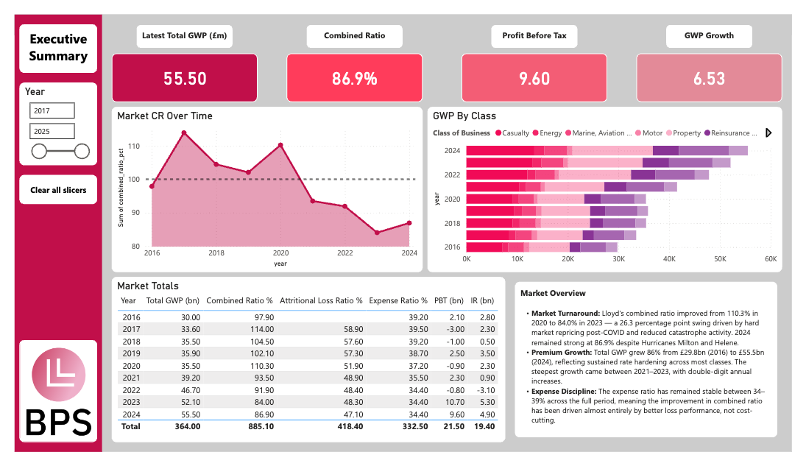
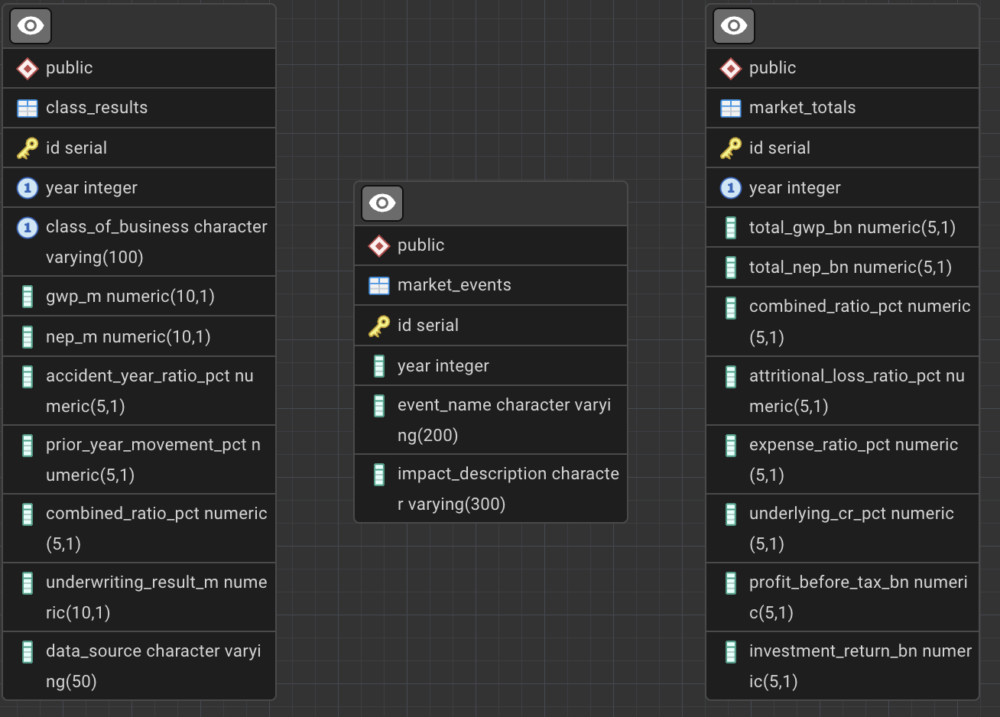
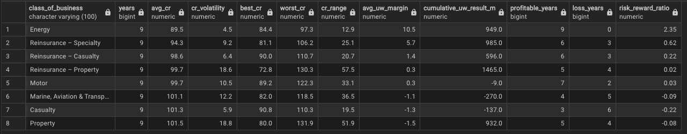
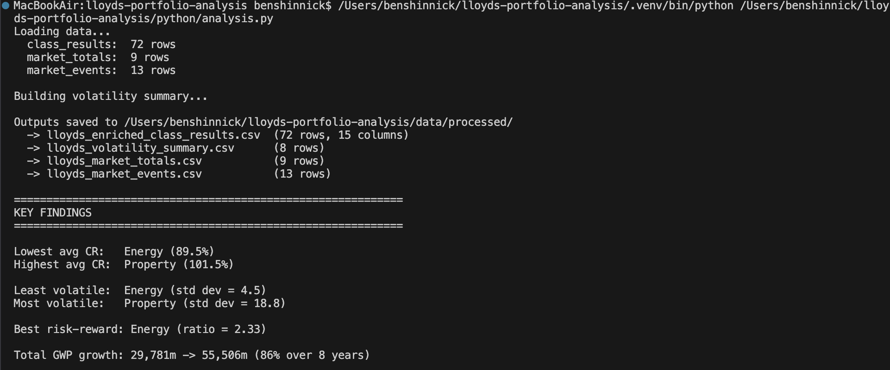
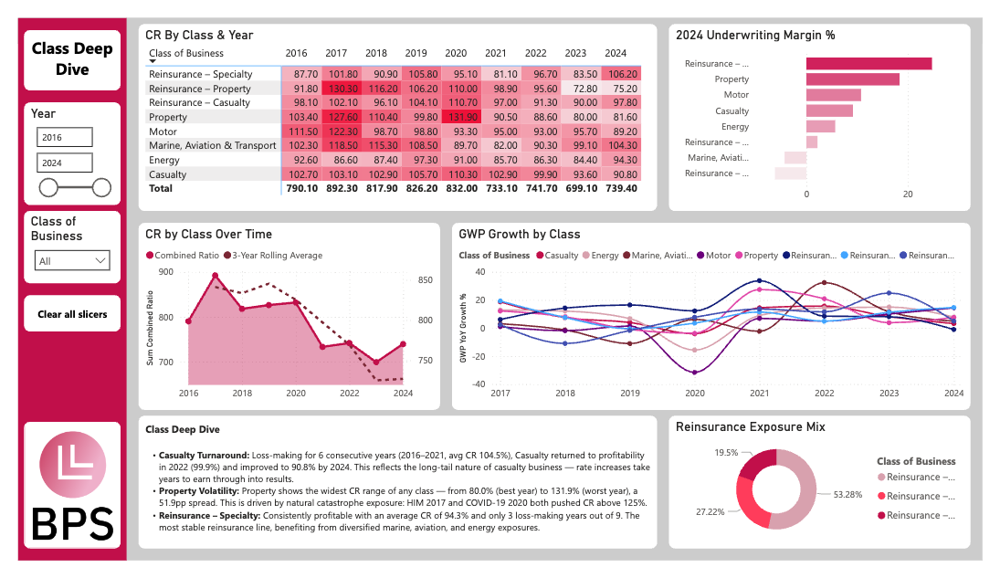
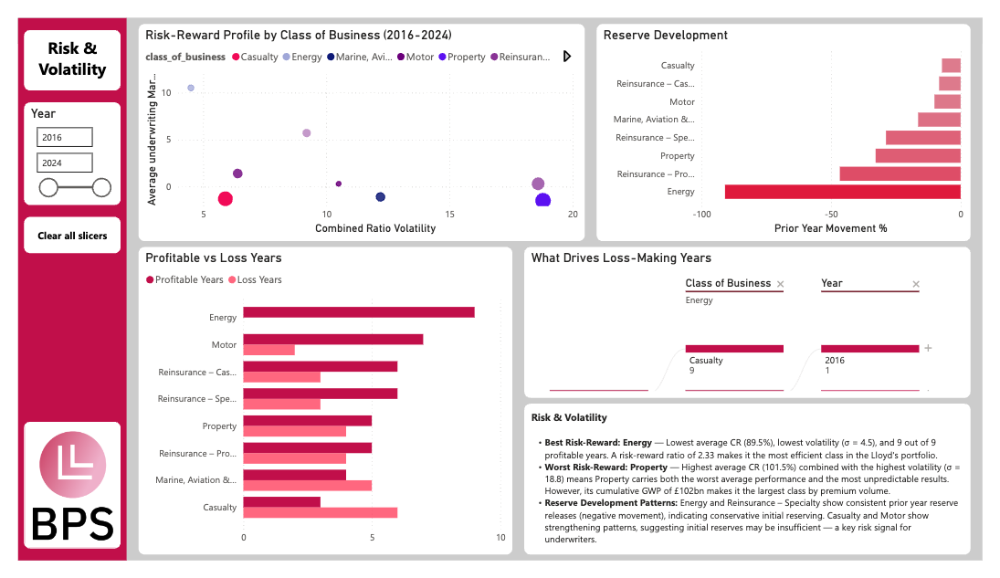

# Lloyd's of London — Market Portfolio Analysis (2016–2024)


A full-stack data analytics project analysing 9 years of Lloyd's of London underwriting performance across 8 classes of business. Built with PostgreSQL, Python, and Power BI to demonstrate how data analysis supports commercial insurance underwriting decisions.



---

## Key Findings

- **Energy** is the best risk-adjusted class — lowest average combined ratio (89.5%) with the least volatility (σ = 4.5), giving it the highest risk-reward ratio of 2.33
- **Property** is the most volatile class (σ = 18.8) driven by catastrophe exposure — HIM 2017 pushed its CR to 130.3% before hard market repricing brought it to 83.3% by 2023
- **Casualty** was loss-making for 6 consecutive years (2016–2021) before returning to profitability in 2022, illustrating the long-tail underwriting cycle
- Lloyd's total GWP grew 86% from £29.8bn to £55.5bn over the period, reflecting sustained hard market conditions post-2017
- The market achieved a combined ratio below 90% in both 2023 (84.0%) and 2024 (86.9%) — the strongest back-to-back performance in the dataset

---

## Project Structure

```
lloyds-portfolio-analysis/
│
├── sql/
│   ├── 01_create_tables.sql          # Database schema (3 tables)
│   ├── 02_insert_data.sql            # Full dataset (94 INSERT statements)
│   ├── 03_analytical_queries.sql     # 8 analytical queries
│   └── query_results/                # CSV exports of query outputs
│       ├── query1_yoy_trend.csv
│       ├── query2_rolling_avg.csv
│       ├── query3_market_share.csv
│       ├── query4_best_worst.csv
│       ├── query5_volatility.csv
│       ├── query6_market_cycle.csv
│       ├── query7_reserves.csv
│       └── query8_vs_market.csv
│
├── python/
│   └── analysis.py                   # Data enrichment script (7 calculated fields)
│
├── data/
│   ├── raw/                          # CSV exports from PostgreSQL
│   │   ├── class_results.csv
│   │   ├── market_totals.csv
│   │   └── market_events.csv
│   └── processed/                    # Enriched CSVs for Power BI
│       ├── lloyds_enriched_class_results.csv
│       ├── lloyds_volatility_summary.csv
│       ├── lloyds_market_totals.csv
│       └── lloyds_market_events.csv
│
├── dashboard/
│   └── lloyds_portfolio_analysis.pbix
│
├── screenshots/
│   ├── dashboard_overview.png
│   ├── dashboard_class_deep_dive.png
│   ├── dashboard_risk_volatility.png
│   ├── pgadmin_schema.png
│   ├── pgadmin_query5_volatility.png
│   ├── pgadmin_query7_reserves.png
│   └── python_output.png
│
├── lloyds_portfolio_data.xlsx        # Source data workbook
└── README.md
```

---

## Tech Stack

| Layer | Tool | Purpose |
|-------|------|---------|
| Data Storage | PostgreSQL | Relational database with 3 normalised tables |
| Data Extraction | pgAdmin 4 | Query execution and CSV export |
| Data Enrichment | Python (pandas) | 7 calculated fields, volatility analysis |
| Visualisation | Power BI | 3-page interactive dashboard |
| Source Data | Lloyd's Annual Reports | Official market performance data (2016–2024) |

---

## Database Schema

**3 tables, 94 rows of real market data:**

**`class_results`** (72 rows) — Core analysis table. 9 years × 8 classes of business with GWP, NEP, accident year ratio, prior year reserve movement, combined ratio, and underwriting result.

**`market_totals`** (9 rows) — Aggregate market performance including attritional loss ratio, expense ratio, underlying combined ratio, and profit before tax.

**`market_events`** (13 rows) — Major catastrophes and market events for contextual analysis (HIM 2017, COVID-19, Hurricane Ian, Ukraine conflict, etc.).



---

## Analytical SQL Queries

8 queries demonstrating window functions, CTEs, JOINs, and aggregations:

| # | Query | Techniques | Underwriting Insight |
|---|-------|-----------|---------------------|
| 1 | YoY Combined Ratio Trend | `LAG()`, `PARTITION BY` | Tracks underwriting cycle movement per class |
| 2 | Rolling 3-Year Average CR | `AVG() OVER (ROWS BETWEEN)` | Smooths catastrophe noise to reveal true trend |
| 3 | GWP Market Share | CTE + nested window functions | Shows portfolio concentration shifts |
| 4 | Best & Worst Classes Per Year | `RANK()` | Identifies consistent outperformers |
| 5 | Volatility Analysis | `STDDEV()`, `CASE` aggregation | Risk-reward profiling for portfolio decisions |
| 6 | Underwriting Cycle Indicator | `LAG()` + `LEFT JOIN` events | Classifies hard/soft market phases |
| 7 | Reserve Development | Conditional aggregation | Reveals which classes carry reserve risk |
| 8 | Class vs Market Performance | Multi-table `JOIN` | Spots structural outperformers/underperformers |

Volatility Query Results:


Reserves Query Results:



---

## Python Enrichment

The `analysis.py` script adds 7 calculated fields to the raw data:

- **cr_yoy_change** — Year-on-year combined ratio movement (percentage points)
- **cr_rolling_3yr** — 3-year rolling average combined ratio
- **profitability_band** — Categorical label (Strong Profit / Moderate Profit / Marginal / Mild Loss / Significant Loss)
- **underwriting_margin_pct** — Inverse of combined ratio (positive = profitable)
- **gwp_share_pct** — Each class's share of total Lloyd's GWP per year
- **vs_market_pp** — Class combined ratio vs market average (percentage points)
- **gwp_yoy_growth_pct** — Premium growth rate per class

It also produces a **volatility summary table** (1 row per class) with average CR, standard deviation, range, risk-reward ratio, and cumulative underwriting result — used directly in the scatter plot.



---

## Power BI Dashboard

**3 pages, each telling a different story:**

### Page 1 — Market Overview
KPI cards, combined ratio trend with event annotations, GWP composition by class, and market totals table. Answers: *"How has Lloyd's performed overall?"*


### Page 2 — Class Deep Dive
Interactive slicer for class selection, CR trends by class, underwriting margin comparison, and a heatmap matrix with conditional formatting. Answers: *"Which classes are profitable and how have they changed?"*



### Page 3 — Risk & Volatility
Scatter plot (average margin vs CR volatility, sized by GWP), profitable vs loss-making years, reserve development patterns, and full volatility summary. Answers: *"Where should an underwriter focus, and what are the risks?"*



---

## Data Sources

All data sourced from publicly available Lloyd's of London publications:

- **Lloyd's Annual Report 2024** — 2023–2024 class results, market totals
- **Lloyd's Annual Report 2020** — 2016–2020 historical class results
- **Lloyd's Annual Report 2023** — Attritional loss ratio and underlying CR breakdown (2017–2023)
- **Industry publications** (Intelligent Insurer, AM Best, Insurance Marine News) — supplementary 2021–2022 data

2021–2022 class-level data is marked as web-derived in the dataset. Lloyd's does not publish class-level loss ratio vs expense ratio breakdowns — only aggregate market splits — so the analysis works with combined ratios at class level, which reflects how Lloyd's actually reports this data.

---

## Methodology & Data Notes

This project works exclusively with publicly available data, which required several analytical decisions where Lloyd's reporting didn't provide complete granularity. These are documented here for transparency.

### 1. Attritional Loss Ratio & Underlying CR — 2016 Gap

Lloyd's did not report attritional loss ratio or underlying combined ratio in their current format prior to 2017. These metrics were introduced as part of the Performance Management Directorate's reporting improvements. As a result, the `market_totals` table contains null values for `attritional_loss_ratio_pct` and `underlying_cr_pct` in 2016. Dashboard visuals using these fields begin from 2017 rather than 2016.

### 2. Net Earned Premium — Derived Calculation

Lloyd's publishes gross written premium (GWP) at class level but does not consistently report net earned premium (NEP) by class. NEP was therefore derived using the mathematical relationship between underwriting result and combined ratio:
```
NEP = Underwriting Result / (1 - Combined Ratio / 100)
```

This is a standard technique in market analysis and reconciles closely to published market-level NEP figures. One limitation: when combined ratio is very close to 100% and the underwriting result is near zero, the derivation can produce values that appear low relative to GWP — this reflects the high cession rates in certain classes rather than a calculation error.

### 3. Reinsurance Subclass Allocation

Lloyd's reports reinsurance as a single class in some years but the market operates across three distinct subclasses: Property, Casualty, and Specialty reinsurance. Where aggregate reinsurance figures were available but subclass splits were not, allocation was estimated using GWP share proportions derived from years where full breakdowns were published. This approach assumes a broadly stable portfolio mix within the reinsurance segment, which is consistent with how market analysts typically decompose Lloyd's reinsurance results.

---

## How to Run

**Prerequisites:** PostgreSQL, Python 3, Power BI Desktop

```bash
# 1. Create the database
psql -U postgres -c "CREATE DATABASE lloyds_portfolio_analysis;"

# 2. Build tables and load data
psql -U postgres -d lloyds_portfolio_analysis -f sql/01_create_tables.sql
psql -U postgres -d lloyds_portfolio_analysis -f sql/02_insert_data.sql

# 3. Run analytical queries
psql -U postgres -d lloyds_portfolio_analysis -f sql/03_analytical_queries.sql

# 4. Export tables as CSV from pgAdmin into data/raw/

# 5. Run Python enrichment
cd python
pip install pandas
python analysis.py

# 6. Open dashboard/lloyds_portfolio_analysis.pbix in Power BI
#    Import the 4 CSVs from data/processed/
```

---

## Author

**Ben Shinnick**
Economics & Management Graduate — University of Sussex
Transitioning into commercial insurance underwriting with a data-driven approach.

[LinkedIn](https://linkedin.com/in/your-profile) • [GitHub](https://github.com/your-username)
